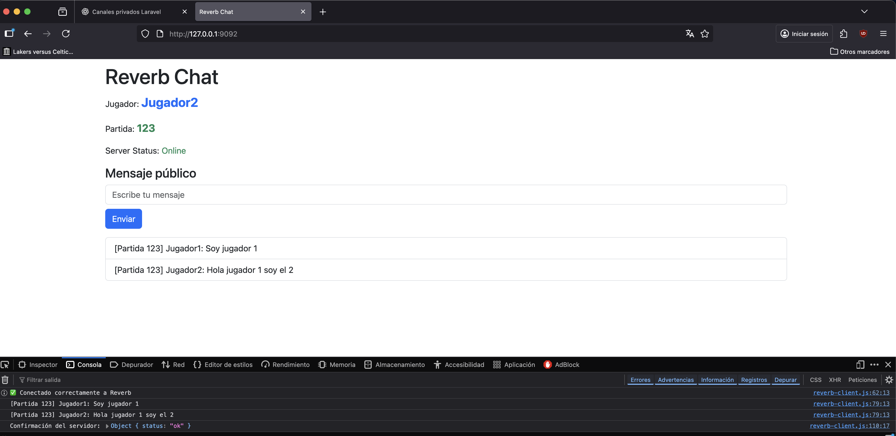

# Websockets en Laravel con Reverb – Canales de partidas (públicos)

---

## **1️⃣ Introducción teórica**

En Laravel, los **canales de broadcasting** permiten enviar mensajes en tiempo real desde el backend a los clientes conectados. Se usan con Websockets (a través de Pusher, Reverb u otros drivers).

Existen **tres tipos principales de canales**:

| Tipo de canal | Descripción | Uso típico | Ventajas |
| --- | --- | --- | --- |
| **Público** (`Channel`) | Cualquiera puede suscribirse sin autenticación. | Chats públicos, notificaciones globales, partidas abiertas. | Simple de configurar, sin autenticación, ideal para demos o pruebas rápidas. |
| **Privado** (`PrivateChannel`) | Solo usuarios autenticados pueden suscribirse. | Mensajes privados, contenido restringido. | Control de acceso, seguridad en mensajes sensibles. |
| **Presencia** (`PresenceChannel`) | Extiende el canal privado y permite saber quién está conectado. | Salas de chat, juegos multijugador con lista de jugadores. | Permite manejar usuarios conectados y su estado (online/offline). |

**Ventajas de un canal público para partidas de demo:**

- No requiere autenticación ni `authEndpoint`.
- Todos los clientes que usen el mismo `gameId` reciben los mensajes automáticamente.
- Muy fácil de levantar en local o para demostraciones rápidas.
- Permite centrarse en la lógica de eventos y mensajes sin configurar permisos complejos.

**Limitaciones:**

- Todos los clientes que conozcan el nombre del canal pueden leer los mensajes (no seguro para producción).
- No permite saber quién está conectado (a menos que se agregue manualmente).

---

## **2️⃣ Configuración paso a paso (Canal público de partida)**

### **Paso 1 – Crear el evento de Laravel**

```php
namespace App\Events;

use Illuminate\Broadcasting\Channel;
use Illuminate\Contracts\Broadcasting\ShouldBroadcast;
use Illuminate\Foundation\Events\Dispatchable;
use Illuminate\Queue\SerializesModels;

class GameMessageSent implements ShouldBroadcast
{
    use Dispatchable, SerializesModels;

    public $message;
    public $gameId;
    public $from;

    public function __construct($message, $gameId, $from)
    {
        $this->message = $message;
        $this->gameId  = $gameId;
        $this->from    = $from;
    }

    public function broadcastOn()
    {
        return new Channel('game.' . $this->gameId); // Canal público dinámico
    }

    public function broadcastAs(): string
    {
        return 'message.sent';
    }

    public function broadcastWith(): array
    {
        return [
            'message' => $this->message,
            'from'    => $this->from,
        ];
    }
}
```

### **Paso 2 – Crear el controlador**

```php
namespace App\Http\Controllers;

use App\Events\GameMessageSent;
use Illuminate\Http\Request;

class ChatController extends Controller
{
    public function sendPrivate(Request $request)
    {
        $msg    = $request->input('message');
        $gameId = $request->input('game_id');
        $from   = $request->input('from') ?? 'Anon';

        event(new GameMessageSent($msg, $gameId, $from));

        return response()->json(['status' => 'ok']);
    }
}
```

### **Paso 3 – Crear la ruta**

```jsx
Route::post('/api/chat/send-private', [ChatController::class, 'sendPrivate']);
```

Nota: Usamos `/api/chat/send-private` como endpoint para enviar mensajes desde los clientes a Laravel.

### **Paso 4 – Configurar el cliente JS**

```jsx
// === Referencias DOM ===
const lblOn      = document.querySelector('#lblOn');
const lblOff     = document.querySelector('#lblOff');
const txtMensaje = document.querySelector('#txtMensaje');
const btnEnviar  = document.querySelector('#btnEnviar');
const ulMessages = document.querySelector('#messages');

// === Parámetros del juego ===
const gameId = '123'; // o dinámico desde tu app

//Ejemplo para probar:
// const token1 = '1|fwFfIVCC0l5D9FQruHRwdXHaOr90wHxAWmXo4ndz1c969f73';
const userName1 = 'Jugador1';

document.querySelector('#lblPlayer').textContent = userName1; // o userName2 según el cliente
document.querySelector('#lblGame').textContent = gameId;

// === Parámetros de conexión ===
const wsHost = '127.0.0.1';
const wsPort = '8080';
const apiPort = '8000';

// Configuración Pusher para Reverb
const pusher = new Pusher('local-app-key', {
    wsHost: wsHost,
    wsPort: wsPort,
    forceTLS: false,
    enabledTransports: ['ws'],
    cluster: 'mt1',
    disableStats: true,  // Evita llamadas externas
    enabled: true,
    // Evitamos reconexión automática infinita
    //reconnectAttempts: 0,
    //reconnectDelay: 0,
    authEndpoint: `http://${wsHost}:${apiPort}/broadcasting/auth`, // importante
    auth: {
        headers: {
        'Accept': 'application/json'
        }
    }
});

// Canal privado de la partida
const channel = pusher.subscribe(`game.${gameId}`);

// ======== Estado Online / Offline ========
function setOnline() {
    lblOn.style.display = '';
    lblOff.style.display = 'none';
}

function setOffline() {
    lblOn.style.display = 'none';
    lblOff.style.display = '';
}

// ======== Eventos globales de conexión ========
pusher.connection.bind('connected', () => {
    //console.log('Conectado a Reverb');
    console.info('✅ Conectado correctamente a Reverb');
    setOnline();
});

pusher.connection.bind('error', (err) => {
    if (err.data.code === 1006) {
        console.warn('⚠️ Conexión perdida con Reverb');
    } else {
        console.error('⚠️ Error WebSocket:', err);
    }
    setOffline();
});

// ======== Recepción de mensajes en tiempo real ========
channel.bind('message.sent', (data) => {
    //console.log('Mensaje recibido desde servidor:', data.message);
    console.log(`[Partida ${gameId}] ${data.from}: ${data.message}`);
    const li = document.createElement('li');
    li.textContent = `[Partida ${gameId}] ${data.from}: ${data.message}`;
    li.classList.add('list-group-item');
    ulMessages.appendChild(li);
});

// ======== Enviar mensaje al backend ========
btnEnviar.addEventListener('click', () => {
    const mensaje = txtMensaje.value.trim();
    if (!mensaje) return;

    const payload = {
        message: mensaje,
        game_id: gameId,
        from: userName1,
    };

    // Usamos wsHost para construir la URL dinámicamente
    const url = `http://${wsHost}:${apiPort}/api/chat/send-private`;

    fetch(url, {
        method: 'POST',
        headers: {
            'Content-Type': 'application/json',
            'Accept': 'application/json'
        },
        body: JSON.stringify(payload),
    })
    .then(res => res.json())
    .then(resp => {
        console.log('Confirmación del servidor:', resp);
        txtMensaje.value = '';
    })
    .catch(err => console.error('Error al enviar:', err));
});
```

### **Paso 5 – HTML para mostrar jugador, partida y estado**

```html
<!DOCTYPE html>
<html lang="en">
<head>
  <meta charset="UTF-8">
  <title>Reverb Chat</title>
  <link href="https://cdn.jsdelivr.net/npm/bootstrap@5.3.0-alpha1/dist/css/bootstrap.min.css" rel="stylesheet">
</head>
<body class="container">
  <h1 class="mt-2">Reverb Chat</h1>
<p>
    Jugador: <span id="lblPlayer" class="text-primary fw-bold fs-4">Jugador1</span>
</p>
<p>
    Partida: <span id="lblGame" class="text-success fw-bold fs-5">123</span>
</p>
  <p>
    Server Status:
    <span id="lblOn" class="text-success">Online</span>
    <span id="lblOff" class="text-danger">Offline</span>
  </p>

  <!-- Mensaje público -->
  <div class="row mb-2">
    <div class="col">
      <h4>Mensaje público</h4>
      <input type="text" id="txtMensaje" class="form-control" placeholder="Escribe tu mensaje">
      <button id="btnEnviar" class="btn btn-primary mt-2">Enviar</button>
    </div>
  </div>

  <!-- Listas -->
  <ul id="messages" class="list-group mt-3"></ul>

  <!-- Pusher JS -->
  <script src="https://js.pusher.com/8.0/pusher.min.js"></script>
  <script src="./js/reverb-client.js"></script>
</body>
</html>

```

Para probarlo hemos creado tres clientes, triplicando el código, pero cambiando la sala de la partida de uno de ellos:

```html
// === Parámetros del juego ===
const gameId = '123'; // esto será dinámico desde tu app
const userName1 = 'Jugador1';

// === Parámetros del juego. El cliente 2 está configurado para ser lanzado con Vite ===
const gameId = '123'; // esto será dinámico desde tu app
const userName1 = 'Jugador2';

// === Parámetros del juego ===
const gameId = '999'; // esto será dinámico desde tu app
const userName1 = 'Jugador3';
```

Tendremos que levantar los servidores API y Reverb:

```bash
php artisan serve
```

```bash
php artisan reverb:start
```

Y en otras tres terminales levantamos los clientes. El primero es un aplicación sencilla con JS, el segundo usa Vite y el tercero es TS.

Para el segundo la configuración de vite-config.js es:
```javascript
import { defineConfig } from 'vite';

export default defineConfig({
  server: {
    host: '127.0.0.1',
    port: 9092, 
    cors: true,
  },
});
```

Y en el tercero, vite-config.ts:
```typescript
import { defineConfig } from 'vite';

export default defineConfig({
  server: {
    host: '127.0.0.1',
    port: 9093,
    cors: true,
  },
});
```

Los comandos para levantar los tres clientes serán:

```bash
php -S 127.0.0.1:9091
```

```bash
npm run dev
```

```bash
npm run dev
```

Para cada cliente.

Un ejemplo de ejecución:




El jugador 3 como está en otra sala no está suscrito al canal de los usuarios 1 y 2 y no recibe mensajes de ellos; y sus envíos no son recibidos tampoco por los anteriores.


---

## **3️⃣ Consideraciones finales**

- **Sencillez:** Ideal para demos, pruebas locales y chats abiertos.
- **Escalabilidad:** Para producción, los canales privados o de presencia son más seguros.
- **Separación de partidas:** El nombre dinámico del canal (`game.{gameId}`) permite que varios juegos coexistieran sin interferir entre sí.
- **Visualización:** Se puede resaltar jugador y partida en la interfaz usando Bootstrap (`fs-4`, `fw-bold`, `text-primary`/`text-success`).
